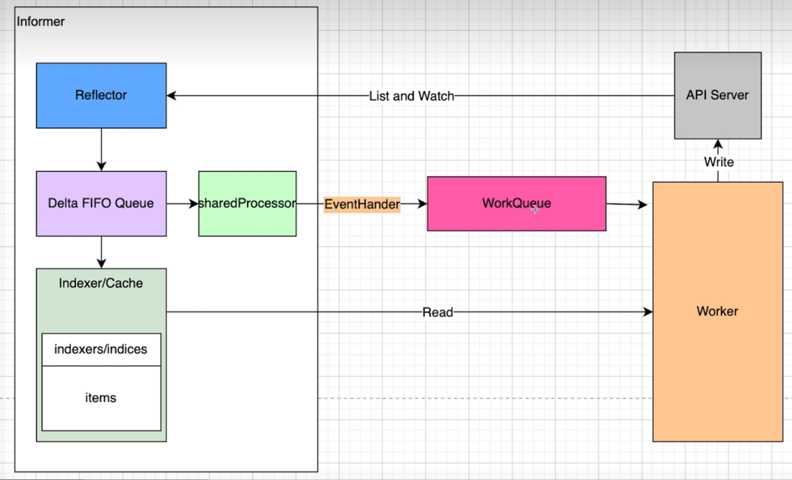
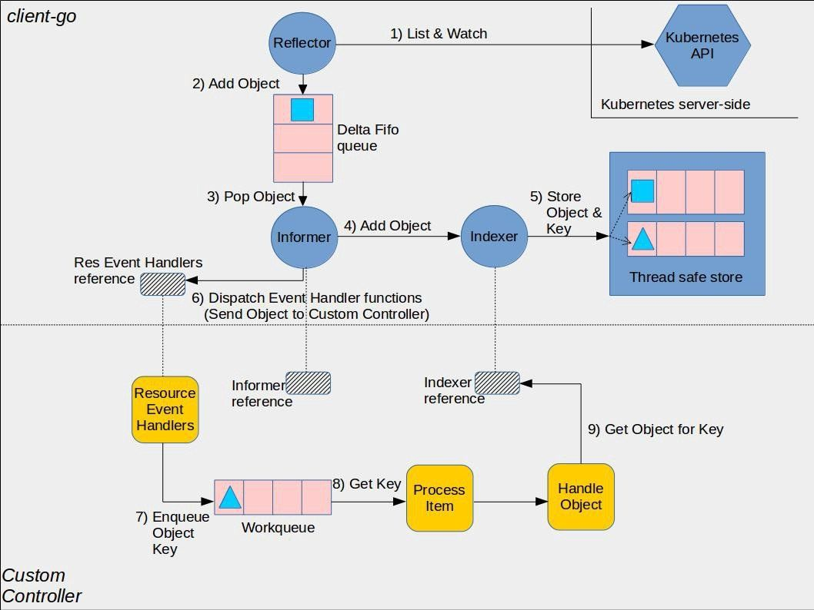
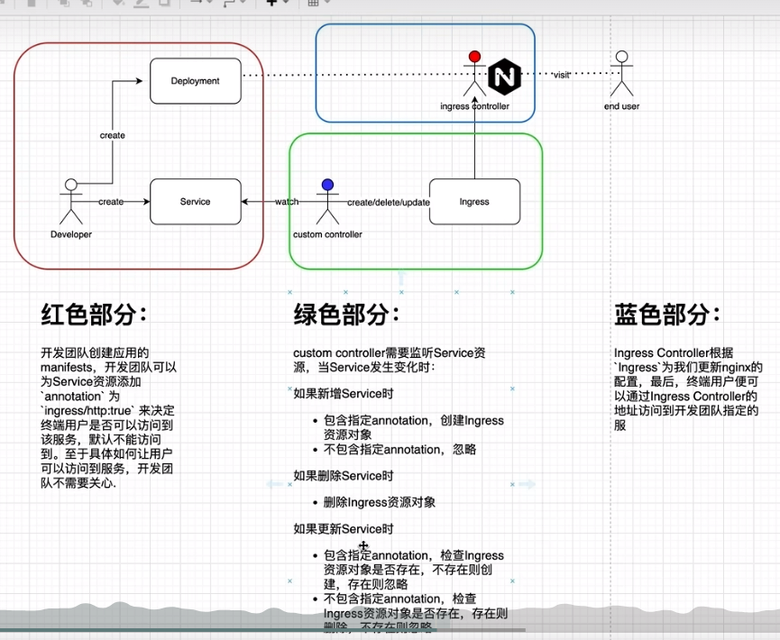

## 1. Informer机制
Informer 机制是 kubernetes 中不依赖任何中间件的 情况下仅通过 HTTP 协议实现消息的实时性、可靠性、顺序性通信的一种机制。
k8s 是典型的 server-client 架构。etcd 存储集群的数据信息， apiserver 作为统一的操作入口，任何对数据的操作都必须经过 apiserver。
客户端通过 ListAndWatch 机制查询 apiserver，而 informer 模块则封装了 List-watch。
ListAndwatch 是 k8s 统一的异步消息处理机制，保证了消息的实时性、可靠性、顺序性等，
为声明式风格的 API 奠定了良好的基础，是 k8s 架构的精髓。 Informer 也被称为 Shared Informer，它是可以共享使用的




## 2. 需求分析
该Demo的需求如图所示


## 3. 测试流程
代码编写完成后，为了测试实际效果需先准备一个 pod 及 ingress 资源, 执行命令
```shell
# 安装测试用的pod
kubectl run nginx --image=nginx:stable-alpine

# 安装 ingress-controller
kubectl apply -f https://raw.githubusercontent.com/kubernetes/ingress-nginx/controller-v1.8.1/deploy/static/provider/cloud/deploy.yaml
```

### 3.1 案例一：创建带有ingress/http注解的service
然后准备 Service，其中service中的 annotations 标记有 ingress/http 为 "true"。
这样在该当前operater项目启动后就可以为该service自动创建相关 ingress
```shell
apiVersion: v1
kind: Service
metadata:
  annotations: 
    ingress/http: "true"
  labels:
    run: nginx
  name: nginx
  namespace: default
spec:
  ports:
  - port: 80
    protocol: TCP
    targetPort: 80
  selector:
    run: nginx
```
启动程序后查看ingress是否已经安装到
```shell
PS > kubectl get ingress
NAME    CLASS    HOSTS         ADDRESS   PORTS   AGE
nginx   <none>   example.com             80      54s
```
然后删除已经安装的service后再次查看ingress是否同样会被删除

### 3.2 案例二：手动删除已经创建的 ingress
```shell
kubectl delete ingress nginx
```
删除该ingress后，operator监听到ingress删除事件后会重新创建该ingress
### 3.3 案例三：service移除注解 ingress/http
注解移除后，相关ingress也会被删除

```shell
# 公开80端口
kubectl expose pods/nginx --port=80

# 在浏览器查看是否可以正常连接，结果无响应，查看日志
> kubectl logs -f pods/test
> kubectl logs -f ingress-nginx-controller-7fcc694bd4-5khp4 -n ingress-nginx
I0702 13:49:41.265134   7 store.go:429] "Ignoring ingress because of error while validating ingress class"
 ingress="default/nginx" error="ingress does not contain a valid IngressClass"

```
## 4. 构建镜像
通过上述场景测试后基本已完成了此处需求开发, 接下来就可以构建镜像
将其放到k8s环境中执行. 首先编写 Dockerfile:
```dockerfile
FROM golang:1.20.5 as builder
WORKDIR /app

COPY . .

RUN CGO_ENABLED=0 go build -o ingress-manager main.go

FROM alpine:3.15.3
WORKDIR /app

COPY --from=builder /app/ingress-manager .

CMD ["./ingress-manager"]


```
然后开始构建镜像, 并推送到私有仓库
```shell
docker build -t lynchpi/ingress-manager:1.0.0 . 
docker push lynchpi/ingress-manager:1.0.0
```
然后生成资源清单 ingress-manager.yaml, dry-run 表示试运行而非真正执行创建deployment.
```shell
kubectl create deployment ingress-manager --image lynchpi/ingress-manager:1.0.0 \
--dry-run=client -o yaml > manifests/ingress-manager.yaml
```
接下来尝试执行该资源清单
```shell
> kubectl apply -f .\manifests\ingress-manager.yaml
# 虽然pod已变成Running状态, 那是因为资源清单没有配置相关探针, 实际通过日志可以看到存在权限问题, 这是因为使用了默认的 serviceAccount
> kubectl logs ingress-manager-c6984965c-9qgbp
E0703 13:18:55.623921       1 reflector.go:148] pkg/mod/k8s.io/client-go@v0.27.3/tools/cache/reflector.go:231: Failed to watc
h *v1.Service: failed to list *v1.Service: services is forbidden: User "system:serviceaccount:default:default" cannot list re
source "services" in API group "" at the cluster scope
```
此时需要新增一个 serviceAccount 资源清单, 同时还需为该账户配置service及ingress 集群角色ClusterRole, 角色包含了可以进行的操作.
此处注意区分 ClusterRole 与 Role, ClusterRole具备访问所有Namespace的能力, 而Role仅仅可以访问指定Namespace下的资源
## 5. 创建ServiceAccount, ClusterRole 及 ClusterRoleBinding
```shell
kubectl create serviceaccount ingress-manager-sa --dry-run=client -o yaml > manifests/ingress-manager-sa.yaml

# 注意生成角色后,需要将service中的 create,update,delete 删除,因为service仅需要list及watch操作
kubectl create clusterrole ingress-manager-role --resource=ingress,Service \
--verb list,watch,create,update,delete --dry-run=client -o yaml > manifests/ingress-manager-role.yaml

# 将账户绑定到角色
kubectl create clusterrolebinding ingress-manager-rb --role ingress-manager-role \
 --serviceaccount default:ingress-manager-sa --dry-run=client -o yaml > manifests/ingress-manager-rb.yaml
```
以上资源创建完成后重新来执行
```shell
kubectl delete -f .\manifests\  
kubectl apply -f .\manifests\ 
```
最后通过日志可以看到日志显示正常. 接下来就可以通过编辑service的注解来查看相关ingress是否生效.